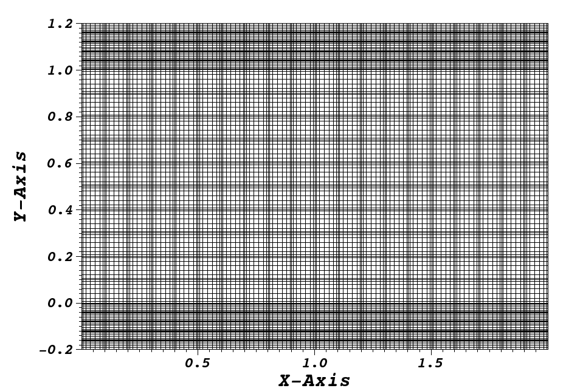

# Conjugate Heat Transfer

In this tutorial, we want to simulate a simple 2D Rayleigh-Benard convection flow. The heat transfer across the horizontal walls of finite thickness is included. If you are not familiar with Nek5000, we strongly recommend you to begin with the periodic hill example first! Similarly, we start by generating a 2D mesh, and modify the case files for this instance afterwards and finally run the case.


## 1. Pre-processing


Users always bear in mind, when you set up a test case in `Nek5000` you must edit case files. Samples can be found in the [Nek5000/examples](https://github.com/Nek5000/NekExamples/tree/35bac75238bf3e7abb6f621615be1f5b3b2bed04) directory included with the release version. As a first step, the user should create a case directory in the corresponding run directory:

```bash
cd $HOME/Nek5000/run 
mkdir conj_ht_rbc
cd conj_ht_rbc
```
then copy the templates to your case directory. This tutorial requires the `ray0.rea` file from the Rayleigh-Bernard example found in [Nek5000/examples/rayleigh](https://github.com/Nek5000/NekExamples/tree/master/rayleigh).

We begin by creating the mesh with appropriate bounday conditions and then we need to set the parameters and case files. 


### 1.1 Mesh generation


This tutorial requires that you have the tools `genbox`, `genmap`, `prenek`, and `nekmerge` compiled. 
Make sure the `Nek5000/bin` directory is in your search PATH. First, we create the mesh for the fluid part by the following input file (called *cht2d.box*) to `genbox`.
In Nek5000, it is important to understand that there are two types of mesh topology: **t mesh** stands for temperature and **v mesh** stands for velocity mesh. The **v mesh** (fluid subdomain) is always the subset of the **t mesh**. Therefore, we generate a **v mesh** and **t mesh** with appropriate BCs separately, later we merge both subdomains using the `nekmerge` tool. 

The fluid mesh is generated by `genbox` with the following input file:

```bash

   ray0.rea
   2        spatial dimension
   2        number of fields
   #========================================================
   #
   #    Example of 2D  .box file for fluid. This gives 2 x 1 
   #    box with 20 x 10 elements
   #
   #    If nelx (y or z) < 0, then genbox automatically generates the
   #    grid spacing in the x (y or z) direction
   #    with a geometric ratio given by "ratio". 
   #    ( ratio=1 implies uniform spacing )
   #
   #========================================================
   #
   Box
   -20     -10            nelx,nely,nelz for Box)
   0      2     1      x0 x1 ratio
   0      1     1      y0 y1 ratio
   W  ,W  ,W  ,W  ,    V bc's  ! NB:  3 characters each !
   I  ,I  ,E  ,E  ,    T bc's  !      You must have 2 spaces!
```

It is worth mentioning that since we are running a 2D case, the input file named *ray0.rea* should be a **2D file, not a 3D file**. In this example, the elements are distributed uniformly in stream-wise (x) and span-wise (y) directions. The thermal boundary conditions for the upper and lower face must be "\E" which indicates that the *Interior boundary*-- this condition is mandatory for the interface between the fluid and solid domains. The lateral surfaces of the inner domain and solid walls are assumed to be adiabatic.

When you run `genbox`, the tool will produce the binary mesh and boundary data file named `box.rea` which should be renamed to `boxfluid.rea`. 

In the next step, we create two upper and _lower solid_ parts of finite thickness h=0.2. The lower domain spans  and the upper domain spans .

:warning: Note: It is important to keep the number of elements equal in spanwise direction for different parts. 

The lower solid domain is generated by `genbox with the following input file:

```bash
   ray0.rea
   2        spatial dimension
   2        number of fields
   #========================================================
   #
   #    This gives a 2 x 1 box with 20 x 5 elements
   #    here used for Rayleigh Benard convection.
   #
   #    Note that number of fields < 0 implies that box.rea
   #    will be ascii.
   #
   #========================================================
   #
   Box
   -20    -5            nelx,nely,nelz for Box)
   0      2     1      x0 x1 ratio
   -0.2      0     1      y0 y1 ratio
   W  ,W  ,W  ,W  ,    V bc's  ! NB:  3 characters each !
   I  ,I  ,t  ,E  ,    T bc's  !      You must have 2 spaces!!
   ```
The tool will produce the binary mesh with boundary data file named ``box.rea`` which should be renamed to ``boxlower.rea``. The upper solid mesh is also generated by genbox with the following input file:

```bash
   ray0.rea
   2        spatial dimension
   2        number of fields
   #========================================================
   #
   #    This gives a 9 x 1 box, periodic in x,
   #    here used for Rayleigh Benard convection.
   #
   #    Note that number of fields < 0 implies that box.rea
   #    will be ascii.
   #
   #========================================================
   #
   Box
   -20    -5            nelx,nely,nelz for Box)
   0      2     1      x0 x1 ratio
   1      1.2     1      y0 y1 ratio
   W  ,W  ,W  ,W  ,    V bc's  ! NB:  3 characters each !
   I  ,I  ,E  ,t  ,    T bc's  !      You must have 2 spaces!!
```
The tool will produce the binary mesh with boundary data file named `box.rea which should be renamed to `boxupper.rea`. 

In [nek5000/tools](https://github.com/Nek5000/Nek5000/tree/master/tools), there is a code `nekmerge.f` that can be compiled with your local Fortran compiler (preferably not g77). By running this code, you can merge upper and lower solid subdomain into one. Below is a typical session, upon typing `nekmerge the user is prompted at the command line:

```bash
   ascii or binary output ? (a/b):
     a
   Input new (output) file name:
     box_solids
   Input source .rea file name or press enter to continue:
     boxlower
   Opening input file: boxlower
   Input source .rea file name or press enter to continue:
     boxupper
```  

Then, we can run the `pretex` tool to merge fluid subdomain with the solid resulting. It is important to first enter the fluid domain file name and then the solid part. Example of running `pretex` tool is shown below:


```bash
 Choose a Name for This Session:
 cht2d
   Beginning Session cht2d
   1 READ PREVIOUS PARAMETERS 
   2 TYPE IN  NEW  PARAMETERS 
   3 CONJ. HEAT TRANSFER MERGE
 Choose item:
   3
   3
 Enter name of fluid session
   boxfluid
 Enter name of the solid session
   box_solids
 Exiting session 
``` 

Now, the user needs to run `reatore2` and `genmap` tools in order to produce `cht2d.re2` and `cht2d.ma2` binary files respectively.


  
<p align="center">
  
</p>

### 1.2 Case set-up .usr


The [User Routines File (.usr)](http://nek5000.github.io/NekDoc/problem_setup/case_files.html#case-files-usr) file implements various subroutines to allow the users to interact with the solver.

To get started we copy the template to our case directory and then we modify its subroutines accordingly.
```bash 
cp $HOME/Nek5000/examples/conj_ht_rbc/conj_ht.usr cht2d.usr 
```
:warning: Note: in  the [uservp](http://nek5000.github.io/NekDoc/problem_setup/case_files.html#case-files-uservp) subroutine, users should specifiy different variable properties for fluid and solid subdomain. For exapmle, thermal diffusivity ratios of Copper and liquid metal alloy GaInSn (Pr = 0.033) is 10 and thermal diffusivity ratios of Copper and air (Pr = 0.7) is 5.2 , [read more here](https://github.com/Foroozani/MyLecturesNote/blob/main/refrences/turbulent_convection_for_different_thermal_boundary_conditions_at_the_plates.pdf "Turbulent convection for different thermal boundary conditions at the plates"). 


```bash 
      subroutine uservp (ix,iy,iz,ieg)
      include 'SIZE'
      include 'TOTAL'
      include 'NEKUSE'

      if (ifield.eq.1) then
         utrans  = param(1)
         udiff   = param(2)

      else

         utrans  = param(7)        ! thermal properties
         udiff   = param(8)

         if (ieg .gt. nelgv) then   ! properties in the solid
            udiff   = 10.0*param(8) ! conductivity copper/GaInSn
            utrans  = 1.0
         endif

      endif

      return
      end
```

### 1.3 Initial & boundary conditions

In this study, the volumetric heat source is set to be zero *qvol=0* in *t mesh* which can be done in `userq` subroutine. The next step is to specify the initial and boundary conditions. We apply a linear variation of temperature in fluid mesh in *y*-direction where the lower plate is heated and the upper one is cooled, uniformly. Subsequently, we modify `userf`, `userbc` and `useric` as:

```bash
     subroutine userf  (ix,iy,iz,ieg)
     include 'SIZE'
     include 'TOTAL'
     include 'NEKUSE'

      ffx = 0.0
      ffy = temp
      ffz = 0.0

      return
      end
```
In this example, *Ra = 1E7* and *Pr = 0.033*. In order to have averege temperature at , one can impose temperature increment of *deltaT = 2.5* (can be set in `USERDEF.f`) at the bottom plate . Therefore temperature equation across the whole domain is `T(y) = -4.303*y + 2.651`.

:warning: The temperature drop across both solid plates varies with *Pr* and *Ra* and is adjusted at the boundaries. Therfeore `T(y)` equation should be set carefully as shown in the figure [Refrence](https://github.com/Foroozani/MyLecturesNote/blob/main/refrences/turbulent_convection_for_different_thermal_boundary_conditions_at_the_plates.pdf "Turbulent convection for different thermal boundary conditions at the plates").  

<p align="center">
  
</p>


```bash
      subroutine userbc (ix,iy,iz,iside,ieg)

      include 'SIZE'
      include 'TOTAL'
      include 'NEKUSE'
      include 'USERDEF.f'

      ux   = 0.0
      uy   = 0.0
      uz   = 0.0

      !if deltaT=2.512, tempereture equation is 
      temp = -4.303*y + 2.651   
      
      ! bottom plate
      if(y.le.0) then
       temp = 1.0-(y/h)*(deltaT)
      end if
      ! top plate
      if(y.ge.1) then
       temp= ((1.0-y)/(h))*(deltaT)
      end if

      return
      endd
```
...

```bash
      subroutine useric (ix,iy,iz,ieg)

      include 'SIZE'
      include 'TOTAL'
      include 'NEKUSE'
      include 'USERDEF.f'

      ux   = 0.0
      uy   = 0.0
      uz   = 0.0

      temp = 1.0 - y

      if (y.le.0.0) then 
       temp = 1.0-(y/h)*(deltaT)
      else if (y.ge.1.0) then 
       temp=((1.0-y)/(h))*(deltaT)
      end if

      return
      endd
```

### 1.4 Control parameters


The control parameters for any case are given in the `.par` file.
For this case, using any text editor, create a new file called `cht2d.par` and type in the following:

```bash
     #--------------------
     # nek parameter file
     #--------------------

    [GENERAL]
    numSteps          = 8000
    stopAt            = numSteps
    dt                = 5e-02
    variableDT        = yes
    targetCFL         = 0.5
    writeInterval     = 500
    writeControl      = timeStep
    timeStepper       = bdf2

    [PROBLEMTYPE]
    equation = incompNS

    [PRESSURE]
    residualTol = 1e-04
    residualProj = no

    [VELOCITY]
    residualTol = 1e-06
    density = 1.0
    viscosity = 3.1623E-04

    [TEMPERATURE] 

    conjugateHeatTransfer = yes

    rhoCp = 1.0
    conductivity = 3.1623E-04
    residualTol = 1e-06
``` 
In this example, we have set the calculation to stop after 8000-time steps (`numSteps=8000`) and print the checkpoint file every 500-time steps (`writeInterval=500`).
In choosing `viscosity=3.1623E-04` and `conductivity=3.1623E-04`, actually we are setting the Rayleigh *Ra=10e7* and Prandtl *Pr=1*. 


### 1.5 SIZE file 


The static memory layout of Nek5000 requires the user to set some solver parameters through a so called `SIZE` file.
Typically it's a good idea to start from our template.
Copy the `SIZE.template` file from the core directory and rename it `SIZE` in the working directory:

```bash
cp $HOME/Nek5000/core/SIZE.template SIZE

```
Then, adjust the following parameters in the BASIC section  

```bash
      ...    
 
      ! BASIC
      parameter (ldim=2)
      parameter (lx1=8)
      parameter (lxd=12)
      parameter (lx2=lx1)
                                     
      parameter (lelg=400)
      parameter (lpmin=1)
      parameter (lpmax=512)
      parameter (ldimt=1)

      ...
```

For this tutorial we have set our polynomial order to be *N=7* - this is defined in the `SIZE` file above as `lx1=8` which indices that there are 8 points in each spatial dimension of every element.
Additional details on the parameters in the `SIZE` file are given [here](http://nek5000.github.io/NekDoc/problem_setup/case_files.html#case-files-size).  


## 2. Compilation 


With the `hillp.usr`, and `SIZE` files created, we are now ready to compile: 

```bash
makenek cht2d
```

If all works properly, upon compilation the executable `nek5000` will be generated.

Now you are all set, just run

```bash
nekbmpi cht2d 4
```

to launch an MPI jobs on your local machine using 4 ranks. The output will be redirected to `logfile`.


## 3. Post-processing the results


Once execution is completed your directory should now contain multiple checkpoint files that look like this:

```bash
cht2d.f00001
cht2d.f00002
  ...
```
The preferred mode for data visualization and analysis with `Nek5000` is
to use `Visit/Paraview`. One can use the script *visnek*, to be found in `/scripts`. It is sufficent to run:

```bash
visnek cht2d
```

*(or the name of your session)* to obatain a file named `cht2d.nek5000` which can be recognized in `Visit/Paraview`.

In the viewing window, one can visualize the temperature-field as depicted in this figure

<p align="center">
  
</p>

  Steady-State flow field visualized in `Visit/Paraview`. Vectors represent velocity. Colors represent velocity magnitude.  


